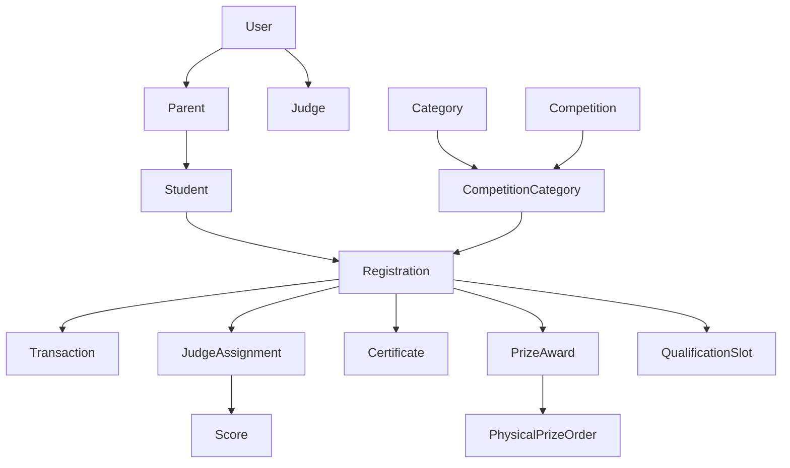

# Database Seeding Requirements

This document outlines the data requirements and schemas needed to seed the Pratibha Parishad local development database. It serves as a guide for resetting and populating the PostgreSQL environment with active mock variables.

---

## 1. Core Seeding Models & Attributes

When populating the database, records must be generated in hierarchical order due to foreign key relationships:



### A. Art Categories (`Category`)
Categories represent the divisions of fine arts hosted by the board.
- **Requirements**:
  - `name`: Must be unique (e.g. `"Bengali Recitation"`, `"Drawing"`, `"Singing"`).
  - `slug`: URL-friendly identifier used internally for examiner specialization lookups (e.g. `"recitation"`, `"drawing"`, `"singing"`).

### B. Contests (`Competition`)
Competitions are seasonal events with strict deadlines and fees.
- **Requirements**:
  - `title`: Name of the competition (e.g. `"Borsha Bodhon 2026"`).
  - `description`: Informative guidelines about themes.
  - `entryFeeINR`: Standard participation fee stored as a Decimal (e.g. `50.00`).
  - `startDate` & `endDate`: Event start and closure dates.
  - `registrationDeadline`: Date after which entries are blocked.
  - `resultDate`: Release schedule for final scores.
  - `isActive`: Boolean flag indicating if registrations are open (defaults to `true`).

### C. Competition Divisions (`CompetitionCategory`)
A join model connecting Competitions with Categories, setting participation age limits.
- **Requirements**:
  - `competitionId` & `categoryId`: Foreign keys.
  - `minAge` & `maxAge`: Integer parameters checking child eligibility (e.g. ages `4` to `12`).

### D. Portals Login Accounts (`User`, `Parent`, `Judge`)
Testing require accounts mapped to appropriate access control levels:

1. **Super Admin / Moderator**:
   - `email`: `admin@pratibhaparishad.org`
   - `role`: `SUPER_ADMIN`
   - Password: `adminpassword` (hashed using standard bcrypt with round factor 10).

2. **Examiner / Judge**:
   - `email`: `judge@pratibhaparishad.org`
   - `role`: `JUDGE`
   - `name`: `"Prof. Swapna Sen"`
   - `specializations`: String array containing category slugs (e.g. `["recitation"]`).

3. **Student Parent**:
   - `email`: `parent@example.com`
   - `role`: `PARENT`
   - `name`: `"Avik Chattopadhyay"`
   - `phone`: `"9830098300"`
   - `address`: `"12/A Gariahat Road, Kolkata, West Bengal - 700019"`

---

## 2. Running the Seed script

A pre-configured JavaScript seeding utility is located in the repository at [seed.js](file:///c:/Development/pratibha/prisma/seed.js).

To execute the database seed:

1. Ensure the PostgreSQL docker container is running:
   ```bash
   docker compose up -d
   ```

2. Invoke the Prisma command or execute the Node script directly:
   ```bash
   node prisma/seed.js
   ```

To make it run automatically on every schema push/migration, you can add this line to your `package.json` under `"prisma"` config:
```json
"prisma": {
  "seed": "node prisma/seed.js"
}
```
And trigger it using:
```bash
npx prisma db seed
```
