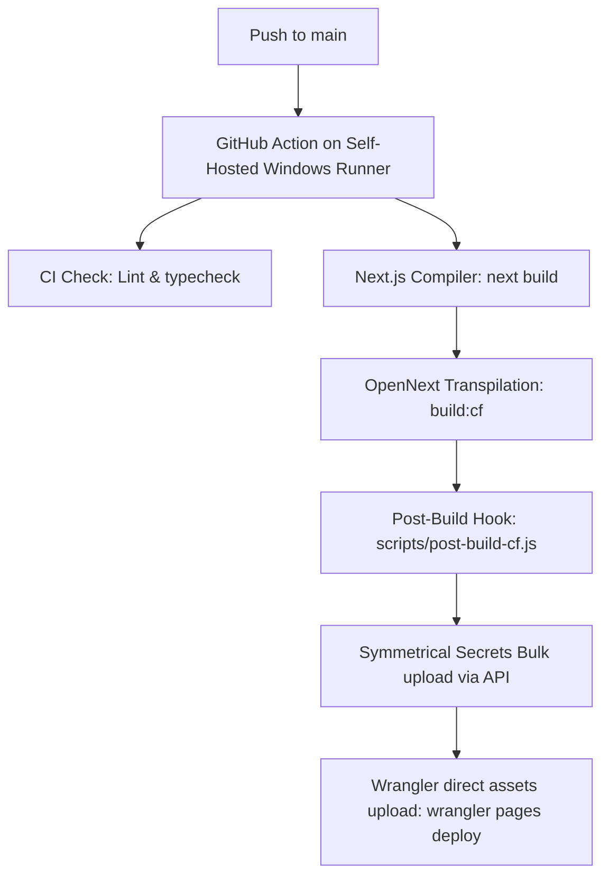

# Self-Hosted Windows Runner Cloudflare Pages Deployment: Deep-Dive Architectures & Implementation

This document provides a highly detailed, production-grade technical guideline and deep dive into the self-hosted deployment architecture for **Pratibha Parishad** on Cloudflare Pages.

---

## 1. 🏗️ Architecture & Direct Upload Mechanics

Rather than relying on Cloudflare's native builder containers—which are constrained by strict execution time caps (20-30 minutes max), memory bounds, and network thresholds—we use a **Direct Upload** strategy. This shifts the heavy compilation load to your local Windows host or self-hosted server, uploading pre-built static assets and optimized edge worker bundles directly via Wrangler.



### Key Compilation Steps:
1. **Next.js & OpenNext Compilation**: The build command runs `next build` followed by `@opennextjs/cloudflare` build. This generates a transpiled V8-compatible worker bundle `.open-next/worker.js` and packs standard public/static files into `.open-next/assets/`.
2. **Flattening Step (`scripts/post-build-cf.js`)**:
   - Copies files and directories recursively from `.open-next/assets/` directly into the root `.open-next/` directory. This is necessary because Cloudflare Pages serves files from the root upload folder; leaving assets nested would yield `404` errors for `_next/static` routes.
   - Generates `_routes.json` mapping rules, routing all static files directly to Cloudflare's global CDN cache and intercepting only the dynamic/API routes with the edge worker:
     ```json
     {
         "version": 1,
         "include": ["/*"],
         "exclude": ["/_next/static/*", "/images/*", "/favicon.ico"]
     }
     ```
   - Renames `worker.js` to `_worker.js`. In Cloudflare Pages, a file named `_worker.js` at the root folder automatically configures Pages in **Advanced Mode**, allowing the worker script to handle all incoming dynamic requests.

---

## 2. ⚡ The Wrangler Config Sync Conflict (Critical Gotcha)

> [!WARNING]
> **The Problem**: In Wrangler v3+, the command `wrangler pages deploy` performs an automatic synchronization of the local project configuration. If a local `wrangler.toml` or `wrangler.jsonc` file is found, Wrangler will push its contents to the Cloudflare API. Because local configuration files typically do not contain production secrets or specific dashboard settings, **Wrangler will silently delete and overwrite existing environment variables and bindings** set up in the Cloudflare dashboard.

### 🛡️ The Bypass Strategy
To prevent environment variables from disappearing on every deployment:
* The deployment workflow explicitly deletes local configuration files immediately before the deployment call:
  ```powershell
  Remove-Item -Force wrangler.toml -ErrorAction SilentlyContinue
  Remove-Item -Force wrangler.jsonc -ErrorAction SilentlyContinue
  ```
* Removing these files forces Wrangler to perform a pure assets upload, preserving all variables, secrets, and bindings managed directly via the Cloudflare dashboard or API.

---

## 3. ⚙️ Shell Environment & Git Hang Prevention on Windows

Self-hosted runners executing on Windows machines can encounter specific environmental hanging bugs. The following configurations are implemented globally at the workflow level to enforce stability:

```yaml
env:
  GIT_TERMINAL_PROMPT: 0
  GCM_INTERACTIVE: never
  FORCE_JAVASCRIPT_ACTIONS_TO_NODE24: true
  MSYS_NO_PATHCONV: 1
  TAR: C:\Windows\System32\tar.exe
```

* **`GIT_TERMINAL_PROMPT: 0` & `GCM_INTERACTIVE: never`**: Prevents Git commands (e.g. during checkouts or module fetching) from opening interactive prompt dialogues that would block the runner indefinitely.
* **`MSYS_NO_PATHCONV: 1`**: Disables auto-path conversion of parameters. This prevents path conversion errors when Windows styles are mixed with Unix-style commands in third-party steps.
* **`TAR: C:\Windows\System32\tar.exe`**: Forces actions to use the native Windows System Tar tool. The default Git-supplied MSYS tar has known directory mapping bugs that cause cache extractions (e.g., node_modules or Next.js build caches) to fail or corrupt on Windows.

To ensure the native Windows system `tar` takes precedence, the workflow forces the Windows system path into the environment path:
```powershell
echo "C:\Windows\System32" | Out-File -FilePath $env:GITHUB_PATH -Encoding utf8 -Append
```

---

## 4. 🚀 Pipeline Performance & Intelligent Caching

To reduce total build times from **15+ minutes** down to **4-6 minutes**, the pipeline incorporates local caching mechanisms.

### A. NPM Caching (`node_modules`)
Rather than downloading all packages from the public NPM registry on every job, the workflow configures local caching of the NPM package index (`~/.npm`):
```yaml
- uses: actions/setup-node@v4
  with:
    node-version: '22'
    cache: 'npm'
    cache-dependency-path: package-lock.json
```
* **How it works**: By caching the package index, `npm ci` is reduced from a heavy network-bound operation (3-4 minutes) to a fast local extraction operation (20-40 seconds).

### B. Next.js Compiler Cache (`.next/cache/`)
Next.js caches compiled bundles to speed up compilation. We cache the `.next/cache` directory between consecutive builds:
```yaml
- name: Cache Next.js build
  uses: actions/cache@v4
  with:
    path: .next/cache
    key: nextjs-${{ runner.os }}-${{ hashFiles('package-lock.json') }}-${{ hashFiles('src/**') }}
    restore-keys: |
      nextjs-${{ runner.os }}-${{ hashFiles('package-lock.json') }}-
      nextjs-${{ runner.os }}-
```
This saves compilation time for pages and bundles that haven't changed.

### C. Concurrency Guarding
To prevent partial states (such as an in-flight deployment being terminated mid-run by a new commit), the concurrency rule cancels jobs only on feature branches, but enforces completion on `main`:
```yaml
concurrency:
  group: ${{ github.workflow }}-${{ github.ref }}
  cancel-in-progress: ${{ github.ref != 'refs/heads/main' }}
```

---

## 5. 🔄 Reusing the Same Physical Runner (Multi-Project Orgs)

You can reuse a single physical Windows host machine to run builds for both **Webspan** and **Pratibha**. 

### Option A: Organization-Level Sharing (Recommended)
If both repositories belong to the same GitHub organization or user account:
1. Go to **Organization/Account Settings** → **Actions** → **Runners**.
2. Click **New self-hosted runner** and configure the runner service at the organization level.
3. Both repository workflows can target the same label:
   ```yaml
   runs-on: [self-hosted, Windows]
   ```
   GitHub Actions will queue jobs and run them sequentially.

### Option B: Running Multiple Concurrent Runner Services (Separate Accounts)
If the repositories are under different repository accounts and cannot share a single registration:

```
                          ┌───────────────────────────┐
                          │    Physical Windows Host  │
                          ├───────────────────────────┤
                          │  [Service: actions.web]   │ ──> Webspan Builds
                          │  [Service: actions.prat]  │ ──> Pratibha Builds
                          └───────────────────────────┘
```

#### Steps to Register a Second Service:
1. Create a separate directory for the Pratibha runner:
   ```powershell
   mkdir C:\Development\pratibha-runner
   cd C:\Development\pratibha-runner
   ```
2. Download the GitHub Actions runner zip package and extract it to this folder.
3. Configure the runner using the token retrieved from **Pratibha's Repo Settings → Actions → Runners**:
   ```powershell
   ./config.cmd --url https://github.com/your-username/pratibha --token YOUR_REGISTRATION_TOKEN
   ```
4. **Critical**: Install the runner as a Windows Service with a **unique name**:
   ```powershell
   ./config.cmd --service --service-name actions.runner.pratibha
   ```
5. Start the service. You can monitor both services running concurrently via PowerShell:
   ```powershell
   Get-Service actions.runner.*
   ```

---

## 6. 🔑 Secrets & Bulk API Propagation

Secrets are propagated symmetrically to Cloudflare Workers using Wrangler's bulk secrets mechanism. 

### Why Bulk?
Setting environment secrets individually via sequential API requests is slow and can result in rate-limit throttling from Cloudflare. We construct a temporary `secrets.json` file in-memory within the runner and upload them simultaneously.

### Workflow Code Implementation:
```powershell
# We construct a hash table in PowerShell of all required secrets:
$secrets = @{
  "DATABASE_URL"     = $env:DATABASE_URL
  "NEXTAUTH_SECRET"  = $env:NEXTAUTH_SECRET
  "RESEND_API_KEY"   = $env:RESEND_API_KEY
  # ... other secrets
}

# Compress into inline JSON and write to a temporary file
$json = $secrets | ConvertTo-Json -Compress
Set-Content -Path "secrets.json" -Value $json -NoNewline

try {
  npx wrangler pages secret bulk secrets.json --project-name pratibha-parishad
} finally {
  # Always clean up the secrets file to prevent leakage
  Remove-Item -Force "secrets.json" -ErrorAction SilentlyContinue
}
```

---

## 7. 💾 Database Drivers & Runtime Compatibility

Pratibha Parishad uses both **Prisma** and **Drizzle** to interact with Neon Postgres. Standard Node.js TCP socket drivers (like `pg` or `mysql2`) are incompatible with serverless edge environments because Cloudflare V8 Workers do not support raw TCP sockets.

### Prisma Integration
To support the serverless environment, Prisma uses `@prisma/adapter-neon` and `@neondatabase/serverless` inside `src/lib/db.ts`:
```typescript
import { PrismaClient } from "@prisma/client";
import { PrismaNeon } from "@prisma/adapter-neon";
import { Pool } from "@neondatabase/serverless";

const prismaClientSingleton = () => {
  const pool = new Pool({ connectionString: process.env.DATABASE_URL });
  const adapter = new PrismaNeon(pool);
  return new PrismaClient({ adapter });
};
```
* **Mechanism**: Prisma delegates network queries to a serverless WebSocket connection pool, allowing secure communication without raw TCP overhead.

### Drizzle Integration
Drizzle is configured to run via HTTP fetch requests inside `src/lib/db/drizzle.ts`:
```typescript
import { neon } from "@neondatabase/serverless";
import { drizzle } from "drizzle-orm/neon-http";

const sql = neon(dbUrl);
const dbInstance = drizzle(sql, { schema });
```
* **Mechanism**: Since HTTP requests are standard web APIs, this requires no special web socket configuration and runs seamlessly at minimal latency on the edge worker.

---

## 8. 🚀 Windows Build Performance Tuning

Because Next.js builds compile thousands of small files, disk I/O performance on Windows is a critical bottleneck. 

### Windows Defender Exclusions (Crucial for Speed)
By default, Windows Defender real-time scanning scans every file created during the build process, which can slow down `npm install` and `next build` commands by up to **2-3x**.

Run the following command in PowerShell as **Administrator** to exclude development directories from real-time monitoring:
```powershell
Add-MpPreference -ExclusionPath "C:\Development"
Add-MpPreference -ExclusionProcess "node.exe"
```
This ensures high disk write speeds, reducing execution time on your self-hosted Windows runner.

---

## 9. 🛠️ Runtime & Build Troubleshooting Playbook

### 1. Build Fails: `npx: command not found` or Node Errors
* **Cause**: The self-hosted runner process lacks access to the node executable path.
* **Fix**: Ensure Node.js (v22 recommended) is installed globally on the Windows host and added to the System `PATH`. Restart the Runner Windows Service to refresh environmental paths.

### 2. Error: `PrismaClientInitializationError` (Database Connection)
* **Cause**: Cloudflare workers operate in a serverless environment and cannot maintain persistent TCP pools.
* **Fix**: Ensure your `DATABASE_URL` uses Neon Postgres's pooled endpoint (usually containing `-pool` in the hostname) and includes `?sslmode=require`.

### 3. NextAuth Login Redirect Failures
* **Cause**: `NEXTAUTH_URL` environment variable mismatch.
* **Fix**: Symmetrically set `NEXTAUTH_URL` to `https://pratibha-parishad.pages.dev` in production and dynamically inject preview URLs using the following format:
  `https://[branch-name].pratibha-parishad.pages.dev`

### 4. Large Assets Slowing Deployments
* **Cause**: Unoptimized media files inside `/public`.
* **Fix**: Compress images (WebP/AVIF format). Ensure large PDF templates or audio tracks are served from a **Cloudflare R2 Bucket** rather than being bundled in the code repository.

### 5. Build Fails: `EPERM: operation not permitted, symlink`
* **Cause**: Creating symbolic links is a restricted privilege on Windows. During the OpenNext generation phase, the builder attempts to symlink `@prisma/client` and other dependencies inside `.open-next/server-functions/default/`.
* **Fix**:
  1. **Enable Windows Developer Mode**: Go to Windows Settings → **Privacy & security** → **For developers**, and toggle **Developer Mode** to **On**. This allows non-elevated user accounts and background services to create symlinks.
  2. **Elevate Build Privileges**: If executing the build manually, run PowerShell or your IDE terminal **as Administrator**.
  3. **Service Configuration**: Ensure that the self-hosted Windows Runner service is running under an account (such as `Local System` or an administrator group) that holds the `SeCreateSymbolicLinkPrivilege`.

