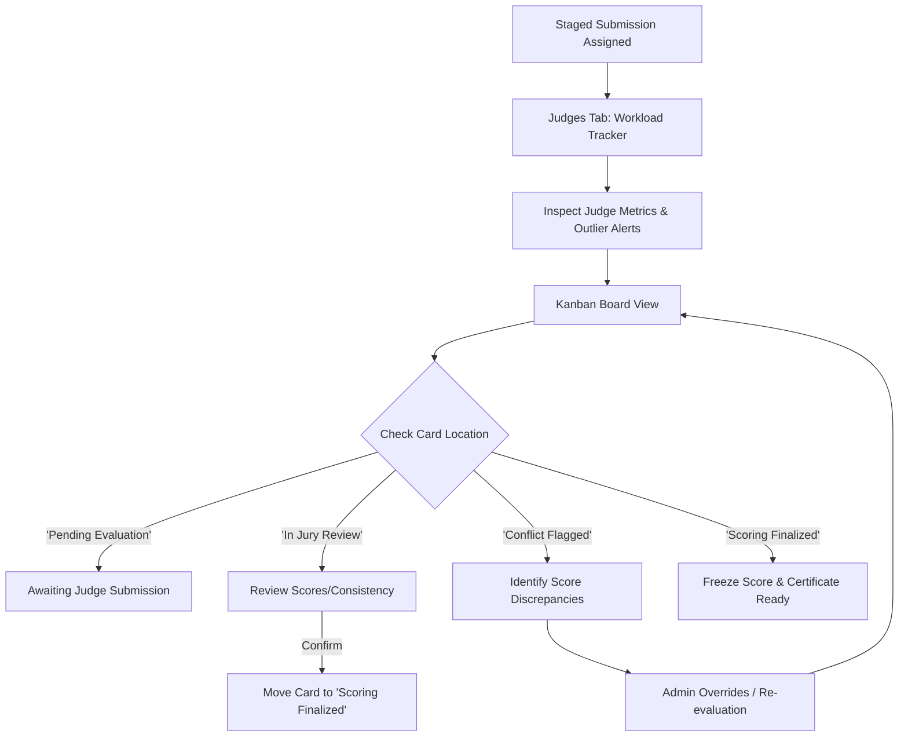

# UI/UX Workflow: Jury Evaluation & Conflict Resolution
**Role**: Council Super Admin / Head of Jury
**Objective**: Monitor judge performance, identify scoring outliers/discrepancies, and manage the grading lifecycle using a visual Kanban system.

---

## 1. Workflow Architecture & Information Flow
This workflow enables the administrator to oversee the quality and pace of evaluations performed by the panel of fine arts examiners, dragging entries through validation stages and flagging anomalies.



---

## 2. Screens Breakdown

### Screen A: Jury Workload Tracker & Audits (Judges Tab - Top Section)
This screen provides statistical insights into each examiner's activity, such as their grading speed and score distribution profiles.

#### UI Layout Wireframe
```
+------------------------------------------------------------------------------------+
| Judges Workspace                                                                   |
+------------------------------------------------------------------------------------+
| JURY PANEL WORKLOAD & OUTLIER AUDIT                                                |
| +-------------------------+ +-------------------------+ +-------------------------+ |
| | Prof. Swapna Sen        | | Pandit Debojyoti Bose   | | [Alert] Outlier Flagged | |
| | Avg Consistency: 82%    | | Avg Consistency: 91%    | | Smt. Mamata Shankar     | |
| | Speed: 1.2h / video     | | Speed: 2.4h / video     | | Avg Score +14.2% dev   | |
| +-------------------------+ +-------------------------+ +-------------------------+ |
+------------------------------------------------------------------------------------+
```

#### Key Visual Components
- **Audit Cards Grid**: A 3-column horizontal grid displaying judge performance statistics.
- **Outlier Visual Warning**: Card highlighted with a yellow border (`border-yellow-500/20`) and caution icon (`AlertTriangle`) when a judge's grading patterns diverge from the group mean.

---

### Screen B: Grading Kanban Lifecycle (Judges Tab - Bottom Section)
A visual drag-and-drop workflow system that displays cards representing student submissions moving through evaluation phases.

#### UI Layout Wireframe
```
+------------------------------------------------------------------------------------+
| GRADING LIFECYCLE KANBAN                                                           |
+------------------------------------------------------------------------------------+
| PENDING EVALUATION | IN JURY REVIEW     | SCORING FINALIZED  | SCORE CONFLICTS     |
| +----------------+ | +----------------+ | +----------------+ | +----------------+ |
| | Rupam Das      | | | Ishita Roy     | | | Vivaan Sen     | | | Priya Das      | |
| | Rabindra S.    | | | Classical D.   | | | Drawing & P.   | | | Recitation     | |
| | [Review]       | | | [Re-queue]     | | | [Re-queue]     | | | Score: 45 pts  | |
| +----------------+ | +----------------+ | +----------------+ | +----------------+ |
+--------------------+--------------------+--------------------+--------------------+
```

#### Key Visual Components
- **Kanban Columns**: Four distinct vertical lanes, each with specific container border opacity and background variations:
  - **Pending Evaluation** (`border-cream/20 bg-cream/5`)
  - **In Jury Review** (`border-yellow-500/20 bg-yellow-500/5`)
  - **Scoring Finalized** (`border-green-500/20 bg-green-500/5`)
  - **Score Conflicts** (`border-red-500/20 bg-red-500/5`)
- **Interactive Participant Cards**: Display student names, categories, current judge, and scores.
- **Quick Action Shifts**: Small context buttons (e.g. `Re-queue`, `Review`, `Approve`) shown on hover (`group-hover:opacity-100`) to let admins move cards between columns.

---

## 3. Step-by-Step Functional Walkthrough

1. **Check Judge Metrics**: The Head of Jury visits the **Judges** workspace and reviews the top grid. They observe that *Smt. Mamata Shankar* has been flagged as a grading outlier due to an average points deviation of +14.2%.
2. **Locate Outlier Submissions**: The admin scrolls down to the **Grading Kanban** and looks for cards assigned to *Mamata Shankar*.
3. **Analyze Score Conflicts**: The admin spots a card for *Priya Das* in the **Score Conflicts** column. The card displays a low score of `45 pts` which caused the flag.
4. **Trigger Review Process**: The admin hovers over the card and clicks **Review** to shift the applicant's card into the **In Jury Review** lane. This sends a notification to the judge or stages the entry for discussion.
5. **Approve and Finalize**: Once the discrepancy is resolved, the admin hovers over the card and clicks **Approve**, moving the card to the **Scoring Finalized** lane. The database updates the entry's scoring status to freeze the results.

---

## 4. UI/UX Analysis & Enhancements

### Design Strengths
- **Immediate Sensory Alerting**: Colors are used intentionally. High-risk states (Conflicts, Outliers) stand out instantly due to yellow and red glowing borders against the dark background.
- **Micro-interactions**: Revealing lane-shift buttons on card hover keeps the card design simple and clean, avoiding cluttered buttons on initial load.

### UX Recommendations & Enhancements
- **Drag-and-Drop Implementation**: The Kanban board currently uses quick-action text buttons. Integrating a library like `react-beautiful-dnd` or native HTML5 drag-and-drop to allow dragging cards between columns would dramatically improve usability.
- **Conflict Explanation Tooltip**: In the **Score Conflicts** column, hovering over the card should display a tooltip explaining *why* it was flagged (e.g., "Score is 3 standard deviations below average" or "Multiple examiners disagree by >15 points").
- **Audit Logs Modal**: Clicking on a judge card in the top section should trigger a modal showing a detailed breakdown of their scoring history over time.
