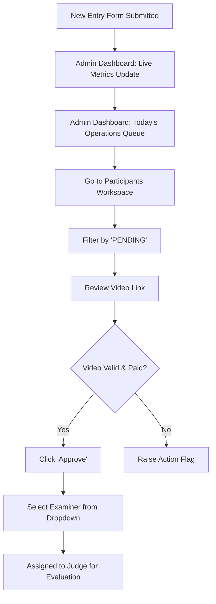

# UI/UX Workflow: Participant Intake & Registration Verification
**Role**: Council Super Admin / Moderator
**Objective**: Monitor incoming registrations, verify video links submitted via Facebook, approve entries, and assign examiners.

---

## 1. Workflow Architecture & Information Flow
This workflow describes how the system processes a participant entry from initial form submission to being ready for evaluation. The Admin works inside a unified control panel to review and authorize entries.



---

## 2. Screens Breakdown

### Screen A: Admin Control Deck (Dashboard Tab)
This is the landing screen for the admin portal. It forces a **dark mode styling** (`bg-charcoal` background with `cream` text and `terracotta` / `gold` accents) to create an immersive, command-center aesthetic.

#### UI Layout Wireframe
```
+------------------------------------------------------------------------------------+
| [Award Icon] PRATIBHA PARISHAD                             Admin Dashboard [LogOut] |
+-----------------------+------------------------------------------------------------+
| CONTROL DECK          | Dashboard Workspace                                        |
| > Dashboard           | Logged in as Council Super Admin | Security: Superuser     |
|   Competitions        +------------------------------------------------------------+
|   Participants        | TODAY'S OPERATIONS COMMAND CENTER (Urgent Actions Alert)   |
|   Judges              | +------------------+ +------------------+ +-----------------+ |
|   Live Voting         | | Ended Contests   | | Pending Judges   | | Courier Queue   | |
|   Certificates        | | Borsha Bodhon    | | Swapna Sen (22)  | | 45 Trophies     | |
|   Courier             | +------------------+ +------------------+ +-----------------+ |
|   Finance             +------------------------------------------------------------+
|   FB Scraper          | LIVE STATUS METRICS                                        |
|   Settings            | [Active: 3] [Pending Jury: 14] [Videos today: +28] [Paid: 9] |
+-----------------------+------------------------------------------------------------+
```

#### Key Visual Components
- **Sidebar Navigation**: High contrast links showing active state (`bg-terracotta text-cream`). Collapsible to conserve screen space.
- **Urgent Action Cards**: Boxed in `border-red-500/10` to draw immediate visual attention to bottlenecks.
- **Live Status Grid**: Six summary cards showing quick numerical counts with HSL tailored color coding (e.g. green for videos posted today, red for pending payments).

---

### Screen B: Participants & Submissions Workspace (Participants Tab)
This is the core execution screen for participant intake. It displays a comprehensive tabular view of all entries with live pagination, search, and action items.

#### UI Layout Wireframe
```
+------------------------------------------------------------------------------------+
| Participants Workspace                                                             |
+------------------------------------------------------------------------------------+
| [ ALL ]  [ PENDING ]  [ PAID ]  [ UNASSIGNED ]                  [Search Entries...] |
+------------------------------------------------------------------------------------+
| ROLL ID        | PARTICIPANT  | CATEGORY       | VIDEO  | STATUS   | EXAMINER      |
+----------------+--------------+----------------+--------+----------+---------------+
| PP-2026-0021   | Bhaskar C.   | Recitation     | [Eye]  | Approved | Sen (85 pts)  |
| PP-2026-0098   | Pooja C.     | Drawing        | [Eye]  | Pending  | + Assign      |
+----------------+--------------+----------------+--------+----------+---------------+
| Showing 1 to 2 of 2 entries                                [Prev] [ 1 ] [Next]     |
+------------------------------------------------------------------------------------+
```

#### Key Visual Components
- **Sub-navigation Filter Pills**: Instant client-side filters (All, Pending, Paid, Unassigned) rendered as pill shapes.
- **Table Data Grid**: Clean rows with subtle hover transitions (`hover:bg-charcoal/45`). Text colors demarcate state (`text-green-400` for Paid/Approved, `text-yellow-400` for Pending).
- **Inline Actions**: 
  - **Approve Button**: Quick green button to verify status.
  - **Examiner Select Dropdown**: Dropdown to assign a judge to the entry.

---

## 3. Step-by-Step Functional Walkthrough

1. **Verify Metrics Alert**: The admin logs in and notices a "Pending Payments" indicator of `9` and "Pending Judging" of `14` on the dashboard.
2. **Open Participants Grid**: The admin clicks the **Participants** tab in the left sidebar.
3. **Filter Pending Entries**: The admin clicks the **PENDING** filter pill to isolate unapproved submissions.
4. **Inspect Submission Video**: The admin clicks the **Link** icon in the "Video Link" column, which opens the student's Facebook video entry in a new browser tab.
5. **Approve Submission**: Once the video format and student parameters are checked, the admin clicks **Approve** in the Actions column. The row updates instantly to display a green "Approved" badge.
6. **Assign Examiner**: The admin clicks the **+ Assign Examiner** dropdown in the same row and selects a judge (e.g., *Prof. Swapna Sen*). The cell updates to show the examiner's name and "Pending" status.

---

## 4. UI/UX Analysis & Enhancements

### Design Strengths
- **Cohesive Dark Aesthetics**: The dark mode matches the portal's artistic theme. The contrast ratios for warning tags (`gold`, `red-400`, `green-400` text against dark charcoal) meet accessibility benchmarks.
- **Tabular Efficiency**: Consolidating links, metadata, and action triggers (approval + assignment) in single rows reduces page-switching latency.

### UX Recommendations & Enhancements
- **Bulk Action Support**: Currently, admins must verify and assign entries one-by-one. Implementing checkbox selectors next to Roll IDs with "Bulk Approve" and "Bulk Assign" buttons in the action bar would optimize high-volume operations.
- **Embedded Video Preview**: Clicking the video link redirects away from the dashboard. Adding a modal overlay (Lightbox) to preview the Facebook video inline would keep the admin focused inside the workspace.
- **Real-Time Database Sync Alerts**: When another admin approves an entry, the page should show a toast alert to prevent double-handling.
