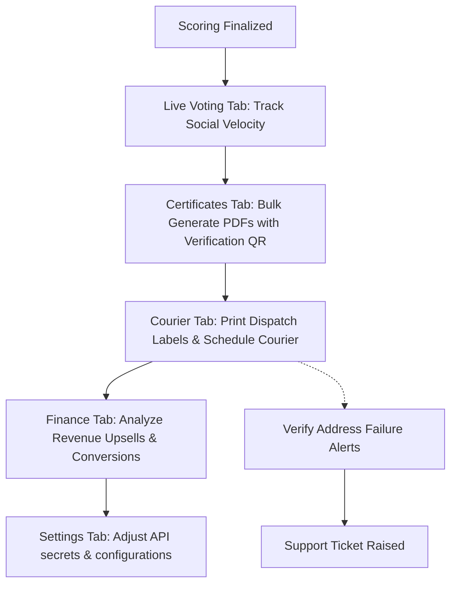

# UI/UX Workflow: Post-Contest Operations & Revenue Analytics
**Role**: Council Super Admin / Operations Manager
**Objective**: Monitor live audience voting, generate digital certificates, track trophy dispatch fulfillment, evaluate revenues, and update system settings.

---

## 1. Workflow Architecture & Information Flow
This workflow handles the transition from grading finalization to public results release, physical shipping of trophies/medals, and revenue reconciliation.



---

## 2. Screens Breakdown

### Screen A: Live Voting Velocity Deck (Voting Tab)
Used to track live student engagement rankings for the People's Choice award, calculating likes, comments, shares, and velocity score.

#### UI Layout Wireframe
```
+------------------------------------------------------------------------------------+
| People's Choice Live Velocity Dashboard                                             |
+------------------------------------------------------------------------------------+
| PARTICIPANT       | LIKES     | COMMENTS  | SHARES    | VELOCITY INDEX  | STATUS   |
+-------------------+-----------+-----------+-----------+-----------------+----------+
| Arnav Mukherjee   | 12,400    | 1,450     | 480       | 98.4 / 100      | [Flame]  |
| Bhaskar C.        | 4,520     | 280       | 92        | 72.1 / 100      | Standard |
+-------------------+-----------+-----------+-----------+-----------------+----------+
```

#### Key Visual Components
- **Data Table**: Columns outlining engagement counts and velocity ratios.
- **Engagement Badges**: Renders a `bg-gold/15 text-gold` badge containing fire emoji (`🔥 Rising Talent`) when a student experiences high velocity.

---

### Screen B: Certificates Queue & QR Validation (Certificates Tab)
Tracks dynamic generation of digital certificates containing verification QR codes.

#### UI Layout Wireframe
```
+------------------------------------------------------------------------------------+
| Certificates Verification & Share Queue                                            |
+------------------------------------------------------------------------------------+
| [ Bulk Generate PDF ]                                                              |
| +------------------+ +------------------+ +------------------+ +-----------------+ |
| | 1,452            | | 14               | | 98%              | | 242             | |
| | Generated/Signed | | Pending Gen     | | QR Success Rate  | | Shared on FB    | |
| +------------------+ +------------------+ +------------------+ +-----------------+ |
+------------------------------------------------------------------------------------+
```

#### Key Visual Components
- **Action Buttons**: Highlighted `Bulk Generate PDF` button in `bg-terracotta` style.
- **Metrics Summary Cards**: 4-column overview of certificate states with colored typography (`gold`, `yellow-400`, `blue-400`, `green-400`).

---

### Screen C: Courier Fulfillment Dispatch (Courier Tab)
Manage shipping of trophies and certificates to student addresses. Integrates with shipping platforms (mocked to Shiprocket API).

#### UI Layout Wireframe
```
+------------------------------------------------------------------------------------+
| eCommerce Dispatch Fulfillment Pipeline                                             |
+------------------------------------------------------------------------------------+
| [ Print Labels & Schedule Pickup ]                                                 |
|                                                                                    |
| (1) Ready for Disp.  -> (2) Labels Gen.  -> (3) Pickup Sched.  -> (4) In Transit   |
|     12 packages          [45 packages]        8 packages           14 packages     |
|                                                                                    |
| [Alert] Failed Deliveries: 2 Packages (Incorrect PIN/Address)                      |
+------------------------------------------------------------------------------------+
```

#### Key Visual Components
- **Shipment Timeline**: Horizontal flow visualization showing packages shifting from step to step, highlighting the active stage in gold (`bg-gold text-charcoal`).
- **Fulfillment Alert Bar**: Yellow warning banner highlighting delivery exceptions (e.g. incorrect address formatting).

---

### Screen D: Revenue Analytical Summary (Finance Tab)
Renders a dashboard summarizing medal upgrades, courses, and avg ticket values.

#### UI Layout Wireframe
```
+------------------------------------------------------------------------------------+
| Revenue Analytical Summary                                                         |
+------------------------------------------------------------------------------------+
| +-------------------------+ +-------------------------+ +-------------------------+ |
| | Medal Upgrades Revenue  | | Workshop Upsells        | | Avg Revenue Per Parent  | |
| | ₹48,200                 | | ₹12,450                 | | ₹142.50                 | |
| | 964 upgrades @ ₹50      | | 125 course enrolls      | | Initial + Upsell items  | |
| +-------------------------+ +-------------------------+ +-------------------------+ |
+------------------------------------------------------------------------------------+
```

---

### Screen E: Workspace Configuration (Settings Tab)
Allows the administrator to manage external webhook secrets and system configurations.

#### UI Layout Wireframe
```
+------------------------------------------------------------------------------------+
| Workspace Configuration                                                            |
+------------------------------------------------------------------------------------+
| WhatsApp Business API URL                                                          |
| [ https://api.whatsapp.com/v1/messages                                          ] |
|                                                                                    |
| Razorpay Webhook Secret                                                            |
| [ ••••••••••••••••                                                              ] |
|                                                                                    |
| [ Save Configuration ]                                                             |
+------------------------------------------------------------------------------------+
```

#### Key Visual Components
- **Input Fields**: Uniform borders (`border-terracotta/30`) with a dark background (`bg-charcoal`).
- **Secure Fields**: Webhook credentials masked using circles or dots for safety.

---

## 3. Step-by-Step Functional Walkthrough

1. **Verify Certificate Status**: The administrator views the **Certificates** tab and verifies that 1,452 digital certificates are generated and signed.
2. **Execute Bulk Print**: The admin clicks **Bulk Generate PDF**. The system processes certificates for remaining entrants.
3. **Dispatch Courier**: The operations manager moves to the **Courier** tab, selects pending packages, and clicks **Print Labels & Schedule Pickup** to send requests to the shipping provider.
4. **Identify Exceptions**: The operations team monitors the red alert banner on the courier dashboard to identify packages returned due to address formatting errors.
5. **Reconcile Finance**: The admin visits the **Finance** tab to confirm total billing from Medal Upgrades (₹48,200) and Course Upsells (₹12,450) matches expected values.
6. **Adjust API Integration**: If webhook configuration changes, the admin updates the WhatsApp/Razorpay parameters under **Settings** and clicks **Save Configuration** to sync.

---

## 4. UI/UX Analysis & Enhancements

### Design Strengths
- **Clean Operations Funnel**: The timeline layout on the Courier page represents package states linearly, clarifying logistics backlog at a glance.
- **Aggregated Revenue Blocks**: Displaying metric averages next to totals simplifies monthly performance assessment.

### UX Recommendations & Enhancements
- **Shipment Provider Selector**: Add a provider selection dropdown (e.g. Shiprocket, Delhivery, Speed Post) on the Courier timeline rather than a hardcoded single interface.
- **Certificate Template Designer**: Implement a simple drag-and-drop certificate overlay editor inside the Settings dashboard to customize font layout and background designs.
- **Export to CSV**: Add an `Export Excel/CSV` button on the Finance page to download raw transaction logs for accounting.
